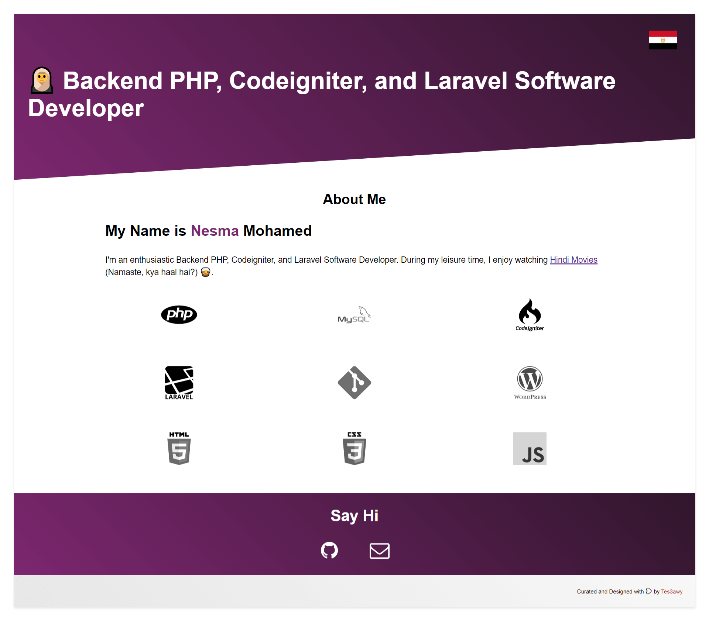

# 🧕 Nesma Mohamed Hesham Portfolio

# Backend PHP, Codeigniter, and Laravel Software Developer

## Table of Contents

1. [Preview](#preview)
2. [Changelog](#changelog)

---

## Preview

---

## Changelog

**01 January 2021**

1. Added `npm-shrinkwrap.json`.
2. Added Favicon.
3. Added `.browserslistrc`.
4. Updated npm packages.
5. Updated CSS styles.
6. Updated Gulp tasks.
7. Updated meta tags.

**04 January 2021**

1. Updated Media Queries.
2. Added `gulp-htmlmin` to minify `html` file.
3. Added `index.app.html` to be the src file, and `index.html` to be the minified version.
4. Added a Preview.

**05 January 2021**

1. Added `gulp-concat-css`.
2. Updated Gulp tasks.
3. Added more meta tags.
